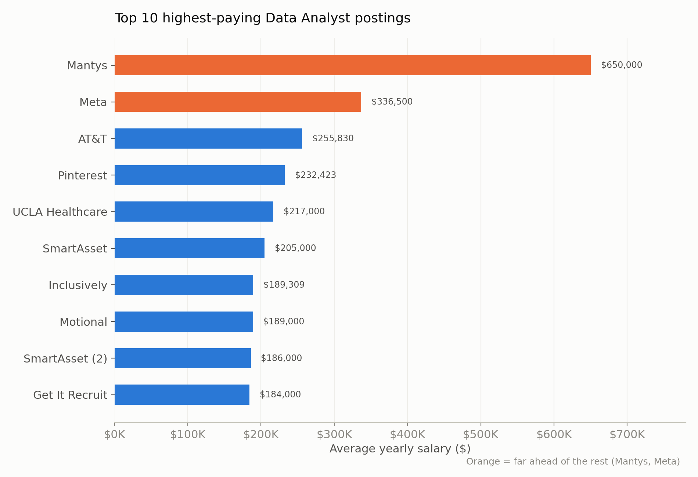
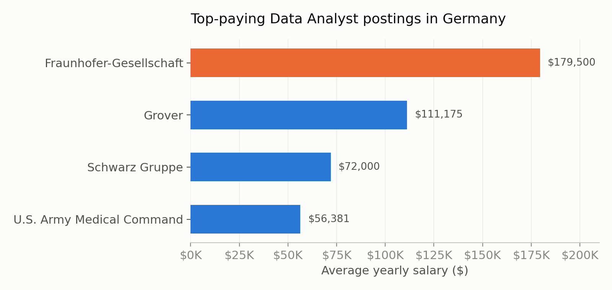
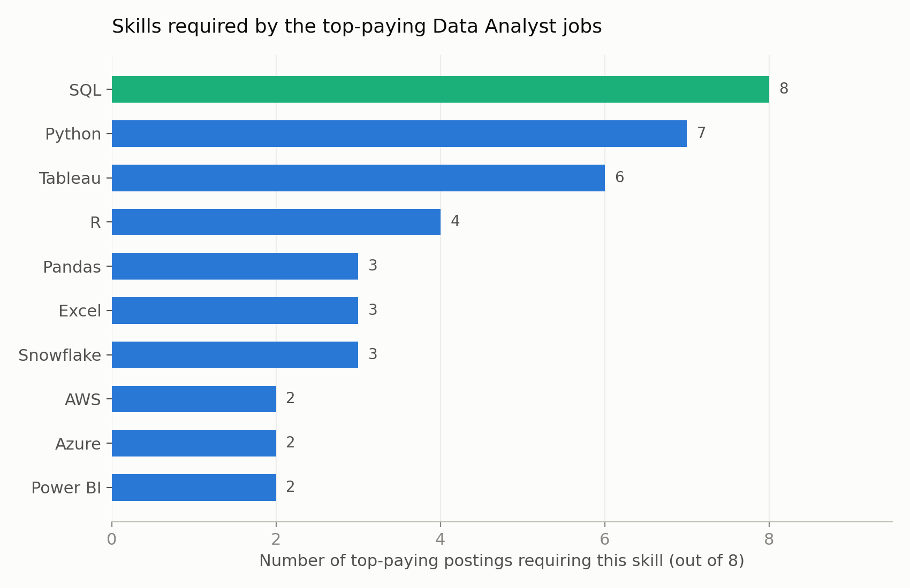
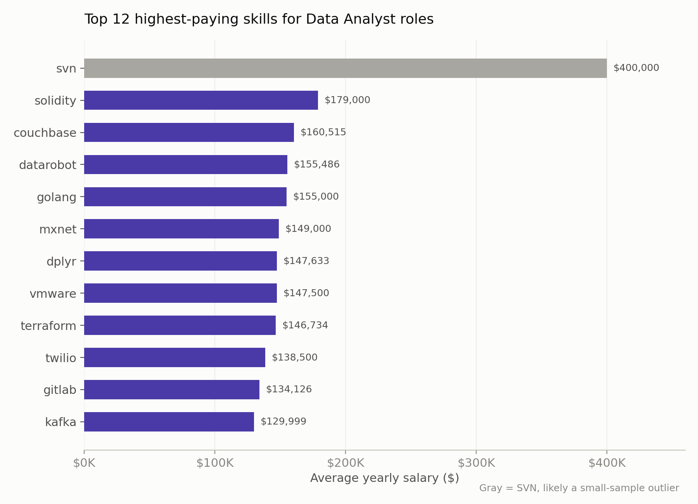
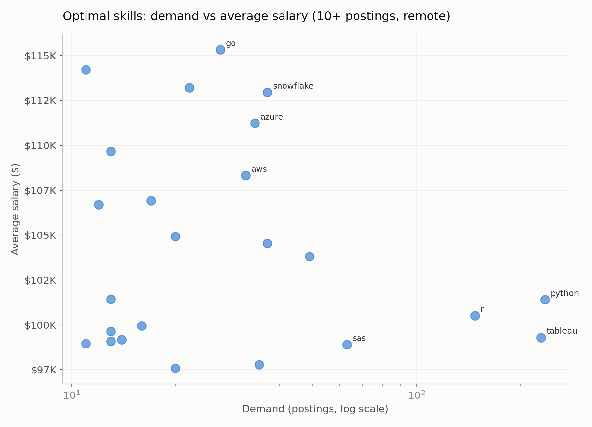

# **Data Analyst Job Market Analysis - 2023 (SQL Project)**
## **Introduction**
This project explores the Data Analyst job market using real-world job posting data. Through a series of SQL queries, it investigates top-paying roles, the skills these roles demand, the most in-demand skills across the market, and which skills offer the strongest combination of demand and salary — the "optimal skills" for a Data Analyst to focus on.

The queries and datasets used in this project can be found here: [project_sql folder](/project_sql/)

## **Background**

This project uses job posting data (2023) covering job titles, salaries, locations, companies, and required skills, structured across fact and dimension tables (job_postings_fact, company_dim, skills_job_dim, skills_dim).

The analysis was guided by five questions:

What are the top-paying Data Analyst jobs?
What skills are required for these top-paying Data Analyst jobs?
What skills are most in demand for Data Analyst roles?
Which skills are associated with the highest salaries?
What are the optimal skills to learn — high demand and high pay?
## **Tools Used**
PostgreSQL — the database used to store and query the job postings dataset; all queries were written using PostgreSQL syntax (e.g. EXTRACT, CTEs, AT TIME ZONE).
VS Code (with a SQL extension) — used to write, run, and organize all queries against the PostgreSQL database.
Git & GitHub — for version control and to host and share this project.
## **Analysis**

Each query below was built to answer one specific question, moving from broad market patterns to a focused, actionable skill list.

### **Top-Paying Data Analyst Jobs**
Identifies the top 10 highest-paying remote Data Analyst roles with a specified salary, then narrows the same analysis to Germany specifically.

``` sql
SELECT
    job_id,
    job_title_short,
    job_location,
    job_schedule_type,
    salary_year_avg,
    job_posted_date,
    company_dim.name AS company_name
FROM job_postings_fact
LEFT JOIN company_dim ON job_postings_fact.company_id = company_dim.company_id
WHERE 
    job_title_short = 'Data Analyst' AND
    job_location = 'Anywhere' AND
    salary_year_avg IS NOT NULL
ORDER BY salary_year_avg DESC
LIMIT 10;
```
#### **Insights**

- **Wide salary range:** Top-paying DA roles span from $184,000 to $650,000 — but the gap is front-loaded, with Mantys ($650K) and Meta ($336K) far ahead of the rest, which cluster closer together between $184K–$256K.
- **Remote-first roles dominate:** All 10 top-paying postings are listed as remote ("Anywhere") and full-time, suggesting the highest salaries aren't tied to a specific office location.


*Bar chart visualizing the salary for the top 10 highest-paying Data Analyst postings; generated with the help of Claude from the obtained SQL query results*

(a) Germany-specific findings
```sql
SELECT
    job_id,
    job_title_short,
    job_location,
    job_schedule_type,
    salary_year_avg,
    job_posted_date,
    company_dim.name AS company_name
FROM job_postings_fact
LEFT JOIN company_dim ON job_postings_fact.company_id = company_dim.company_id
WHERE 
    job_title_short = 'Data Analyst' AND
    job_location = 'Germany' AND
    salary_year_avg IS NOT NULL
ORDER BY salary_year_avg DESC
LIMIT 10;
```
#### **Insights**
- Fraunhofer-Gesellschaft pays the most: $179,500 — over 3x the lowest result ($56,381).
- Only 4 Germany postings had a listed salary, so this is a small sample, not the full market.
- Research-focused employers may pay more: Fraunhofer stands well above the other 3 (more operational) companies.



*Bar chart visualizing salary for the top-paying Data Analyst postings in Germany; generated with the help of Claude from the SQL query results*

### **Skills for Top Paying DA Jobs**
Using a CTE to isolate the top 10 highest-paying remote DA jobs, then joins to skills_job_dim/skills_dim to see which skills those specific roles require.

```sql
WITH top_paying_jobs AS (
    SELECT
    job_id,
    job_title_short,
    salary_year_avg,
    job_posted_date,
    company_dim.name AS company_name
    FROM job_postings_fact
    LEFT JOIN company_dim ON job_postings_fact.company_id = company_dim.company_id
    WHERE 
        job_title_short = 'Data Analyst' AND
        job_location = 'Anywhere' AND
        salary_year_avg IS NOT NULL
    ORDER BY salary_year_avg DESC
    LIMIT 10
)   

SELECT 
    top_paying_jobs.*,
    skills_dim.skills
FROM top_paying_jobs
INNER JOIN skills_job_dim ON top_paying_jobs.job_id = skills_job_dim.job_id
INNER JOIN skills_dim ON skills_job_dim.skill_id = skills_dim.skill_id 
ORDER BY 
top_paying_jobs.salary_year_avg DESC
```
#### **Insights**
- SQL is required in every one of the 8 top-paying postings that listed skills — 100% coverage.
- Python (7 of 8) and Tableau (6 of 8) are close behind, both near-standard alongside SQL.
- 2 of the original top-10 postings list no skills at all in the dataset — a data gap, not a market signal.



*Bar chart showing the most frequently required skills among the top-paying remote Data Analyst jobs.*
### **Most In-Demand DA Skills**
Counts how often each skill appears across all Data Analyst postings overall.
```sql
SELECT 
    skills,
    COUNT(skills_job_dim.job_id) AS demand_count
FROM job_postings_fact
INNER JOIN skills_job_dim ON job_postings_fact.job_id = skills_job_dim.job_id
INNER JOIN skills_dim ON skills_job_dim.skill_id = skills_dim.skill_id 
WHERE
    job_title_short = 'Data Analyst' 
GROUP BY skills
ORDER BY demand_count DESC
LIMIT 5
```
#### **Insights**
- SQL leads by a wide margin: 92,628 postings, ~40% more than #2 (Excel).
- Top 5 splits into two tiers: SQL/Excel lead (65K+ each), Python/Tableau/Power BI form a closer second tier (39K–57K each).
- Excel ranking above Python is a reminder that spreadsheet skills still matter, even in technical DA roles.

| Rank | Overall | Remote | Germany |
|---|---|---|---|
| 1 | SQL (92,628) | SQL (7,291) | SQL (217) |
| 2 | Excel (67,031) | Excel (4,611) | Python (153) |
| 3 | Python (57,326) | Python (4,330) | Excel (141) |
| 4 | Tableau (46,554) | Tableau (3,745) | Tableau (119) |
| 5 | Power BI (39,468) | Power BI (2,609) | Power BI (91) |

*Table comparing the top 5 most in-demand Data Analyst skills across three markets based on the SQL query results.*

### **Top Paying DA Skills**
Calculates the average salary associated with each skill for Data Analyst roles, run for both all postings and remote-only postings.
```sql
SELECT 
    skills,
    ROUND(AVG(salary_year_avg), 0) AS avg_salary
FROM job_postings_fact
INNER JOIN skills_job_dim ON job_postings_fact.job_id = skills_job_dim.job_id
INNER JOIN skills_dim ON skills_job_dim.skill_id = skills_dim.skill_id
WHERE
    job_title_short = 'Data Analyst' AND
    salary_year_avg IS NOT NULL
GROUP BY skills
ORDER BY avg_salary DESC
LIMIT 25
```
#### **Insights**
- SVN tops the list at $400K, but with very few postings behind it — likely a small-sample outlier, not a real market rate.
- Solidity ($179K) and Couchbase ($160K) lead the credible results — both niche, specialized skills (blockchain, NoSQL).
- DevOps tools cluster near the top: Terraform ($147K), GitLab ($134K), Kafka ($130K) — cross-over DevOps skills pay a premium even in analyst roles.


*Bar chart visualizing the top 12 highest-paying skills; generated with the help of Claude from the SQL query results.*

### **Optimal DA Skills**

Combines demand and salary into a single view, filtering to skills appearing in more than 10 postings to avoid small-sample noise.
```sql
SELECT
    skills_dim.skill_id,
    skills_dim.skills,
    COUNT(skills_job_dim.job_id) AS demand_count,
    ROUND(AVG(job_postings_fact.salary_year_avg), 0) AS avg_salary
FROM job_postings_fact
INNER JOIN skills_job_dim ON job_postings_fact.job_id = skills_job_dim.job_id
INNER JOIN skills_dim ON skills_job_dim.skill_id = skills_dim.skill_id
WHERE
    job_title_short = 'Data Analyst' AND
    salary_year_avg IS NOT NULL 
    AND job_work_from_home = TRUE
GROUP BY
    skills_dim.skill_id
HAVING
    COUNT(skills_job_dim.job_id) > 10
ORDER BY
    avg_salary DESC,
    demand_count DESC
LIMIT 25
```
#### **Insights**
- Go, Snowflake, and Azure balance demand and pay well: Go leads at $115K (27 postings), Snowflake ($113K, 37 postings) and Azure ($111K, 34 postings) aren't far behind.
- Python and Tableau offer the highest volume at solid (not top) pay: 236 and 230 postings, both averaging just over $100K — the safest bets even if not the highest earners.
- Data quality note: "sas" appears twice under different skill_ids with identical numbers — likely a duplicate entry, not two real skills.


*Scatter plot visualizing demand against average salary for skills with 10+ postings; generated with the help of Claude from the SQL query results.*
## **What I learned**
This project pushed me to go beyond basic queries and think in terms of real data workflows:

- Joins — combining job_postings_fact with dimension tables to pull in readable names instead of raw IDs, and knowing when a LEFT JOIN is needed to keep unmatched rows.
- Aggregate functions — using COUNT(), AVG(), and ROUND() with GROUP BY to summarize data by category, not just row by row.
- CTEs — breaking a complex question into a clear first step (WITH ... AS) before building the final query, making multi-step logic easier to read and debug.
- Query optimization — simplified the "optimal skills" query from two separate CTEs into one query using HAVING.
- Reading data critically — flagging real issues like a duplicate skill entry (sas under two IDs) and a small-sample outlier (svn at $400K), instead of reporting numbers at face value.
- Turning results into a story — writing clear findings and building visualizations mattered as much as the queries themselves.
## **Conclusion**
This project confirmed, with real data rather than assumption, that SQL, Python, Excel, Tableau, and Power BI form the practical foundation for an entry-level Data Analyst role. It also surfaced a clear next-step skill (a cloud platform, most likely Azure or AWS) worth building toward once the fundamentals are solid.

Beyond the specific findings, this project itself is evidence of applied SQL ability: multi-table joins, CTEs, subqueries, aggregate functions, and query optimization (simplifying a two-CTE query into a single query with HAVING) were all used to answer real, practically motivated questions.